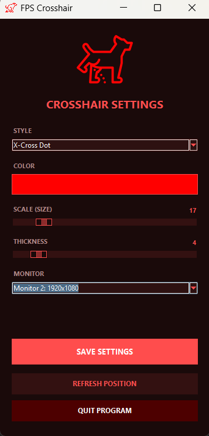

# fpscross2
โปรแกรมสำหรับแสดงเป้าเล็ง (Crosshair) กลางหน้าจอ เพื่อช่วยในการเล่นเกม FPS และเกมอื่นๆ สามารถปรับแต่งรูปแบบ, สี, ขนาด, และความหนาของเป้าเล็งได้อย่างอิสระ



## ✨ คุณสมบัติ (Features)

- **ปรับแต่งได้หลากหลาย:** เลือกสไตล์เป้าเล็งได้ถึง 6 แบบ (Dot, Cross, Circle, T-Shape, Square, X-Cross Dot)
- **เลือกสีได้ตามใจ:** ปรับเปลี่ยนสีของเป้าเล็งได้อย่างอิสระ
- **ปรับขนาดและความหนา:** เพิ่มหรือลดขนาดและความหนาของเป้าเล็งได้ตามความถนัด
- **รองรับหลายหน้าจอ:** สามารถเลือกได้ว่าจะให้เป้าเล็งแสดงผลบนหน้าจอใด
- **บันทึกการตั้งค่า:** โปรแกรมจะจดจำการตั้งค่าล่าสุดของคุณไว้
- **ใช้งานง่าย:** สร้างด้วยไฟล์เดียว ทำให้ดาวน์โหลดและใช้งานได้ทันที

## ⚙️ วิธีการติดตั้งและใช้งาน

### สำหรับผู้ใช้งานทั่วไป (User)

1.  ไปที่หน้า [Releases](https://github.com/Kritsanakorn10/fpscross2/releases)
2.  ดาวน์โหลดไฟล์ `.zip` หรือ `.exe` จากเวอร์ชันล่าสุด
3.  แตกไฟล์ (ถ้ามี) แล้วเปิดโปรแกรม `fps_crosshair.exe` เพื่อใช้งานได้ทันที

### สำหรับนักพัฒนา (Developer)

1.  Clone โปรเจกต์นี้ลงบนเครื่องของคุณ:
    ```bash
    git clone https://github.com/Kritsanakorn10/fpscross2.git
    ```
2.  เข้าไปที่โฟลเดอร์โปรเจกต์:
    ```bash
    cd your-repository-name
    ```
3.  ติดตั้งไลบรารีที่จำเป็น:
    ```bash
    pip install -r requirements.txt
    ```
4.  รันโปรแกรม:
    ```bash
    python fps_crosshair.py
    ```


